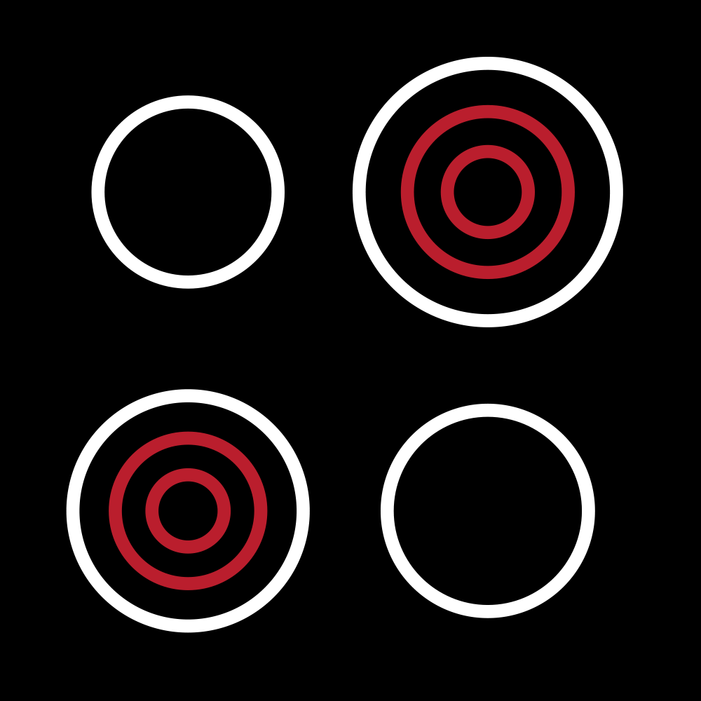

<h1>
  
  InfraKitchen
</h1>

Run your infrastructure like a Michelin-starred kitchen.

    
    

    <a href="https://opensource.electrolux.one/infrakitchen/getting-started/quick-start/">Getting Started</a> | <a href="https://opensource.electrolux.one/infrakitchen/core-concepts/overview/">Core Concepts</a> | <a href="https://opensource.electrolux.one/infrakitchen/guides/platform-engineer-guide/">User Guides</a>

## What is InfraKitchen?

InfraKitchen is an open source Developer Platform that brings Platform Engineering practices to infrastructure management. It enables platform teams to create and continuously maintain reusable infrastructure templates (the "golden path"), while empowering developers to provision and manage their own cloud resources. Developers can adopt new template versions as the platform team evolves best practices, ensuring infrastructure stays secure, compliant, and aligned with organizational standards.

InfraKitchen enables seamless collaboration across different roles throughout the infrastructure lifecycle:

### 🧱 Platform Team (or SRE, Infrastructure Team)

The Platform Team's primary role shifts from fulfilling tickets to creating and continuously evolving the **golden path**:

* **Opinionated Infrastructure-as-Code templates:** Build standardized, versioned templates for common needs (networks, databases, Kubernetes clusters, etc.) that embed best practices and organizational standards.

### 👩‍💻 Developers

Developers are the main beneficiaries, gaining **autonomy and speed** for their infrastructure needs:

* **Self-Service Provisioning:** Provision any cloud resources instantly in the UI or via Pull Request—no more infrastructure tickets. Adopt new golden path versions as the platform team releases improvements.
* **Simplified Complexity:** Predefined templates abstract infrastructure details, enabling teams to provision and operate infrastructure without deep infrastructure expertise.

## Why InfraKitchen

- **Eliminate infrastructure bottlenecks:** Reduce weeks-long provisioning to minutes with self-service infrastructure, while platform teams retain control.
- **Write once, apply everywhere:** Create infrastructure templates once and apply them consistently everywhere.
- **Governance at scale:** Enforce infrastructure standards, security policies, and compliance rules centrally while enabling developer autonomy.
- **Continuous improvement cycle:** Platform teams maintain and evolve templates; developers automatically benefit from improvements.
- **Complete visibility:** Full audit trails show who provisioned what infrastructure, when changes were made, and why—essential for compliance and incident response.

## Getting started

The best way to start with InfraKitchen is to check the [Documentation](https://opensource.electrolux.one/infrakitchen/).

Try InfraKitchen right away with the [example templates repository](https://github.com/electrolux-oss/infrakitchen-example-templates). It includes ready-to-use templates that help you get a proof of concept running quickly.
