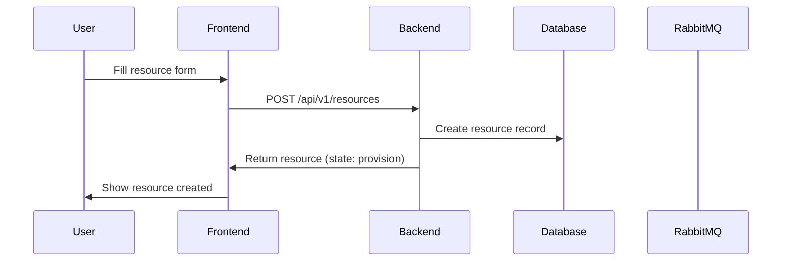
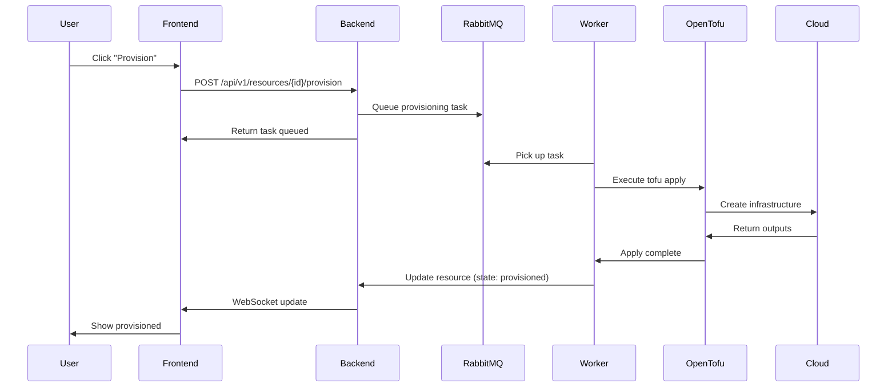
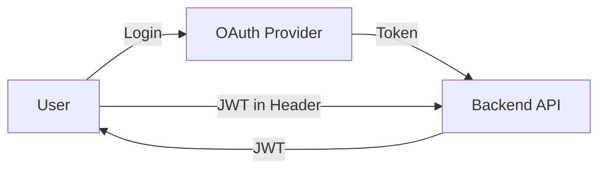

# Architecture

This page provides an overview of InfraKitchen's system architecture and how the components work together.

---

## 🏗️ High-Level Architecture

InfraKitchen follows a modern web application architecture with separated frontend, backend, and infrastructure layers.


### Components

- **Frontend (React/TypeScript)** - User interface for managing infrastructure
- **Backend (Python/FastAPI)** - REST API and business logic
- **PostgreSQL** - Relational database for storing infrastructure state
- **RabbitMQ** - Message broker for asynchronous task processing
- **Worker Processes** - Execute infrastructure provisioning tasks
- **OpenTofu/Terraform** - Infrastructure-as-Code execution engine

---

## 🔄 Request Flow

### 1. **User Creates a Resource**



### 2. **User Provisions the Resource**



---

## 🧩 Backend Module Relations

InfraKitchen's backend is organized into distinct modules with clear responsibilities:


### Module Structure

```
server/src/
├── application/          # Application layer
│   ├── resources/       # Resource management
│   ├── templates/       # Template management
│   ├── integrations/    # Integration management
│   ├── workspaces/      # Workspace sync
│   └── ...
├── core/                # Core utilities
│   ├── adapters/        # External service adapters
│   ├── config.py        # Configuration
│   ├── database.py      # Database connection
│   └── errors.py        # Custom exceptions
│   └── ...
└── fixtures/            # Demo data
```

### Key Layers

1. **View Layer** (`*_view.py`)
      - FastAPI route handlers
      - Request/response validation
      - Authentication/authorization

2. **Service Layer** (`*_service.py`)
      - Business logic
      - Orchestration between modules
      - Transaction management

3. **CRUD Layer** (`*_crud.py`)
      - Database operations
      - Query building
      - Data access patterns

4. **Task Layer** (`*_task.py`)
      - Asynchronous operations
      - Long-running processes
      - Background jobs

5. **Model Layer** (`*_model.py`)
      - SQLAlchemy ORM models
      - Pydantic schemas
      - Data structures

---

## 🔐 Security Architecture

### Authentication Flow



**Supported Methods:**

- OAuth 2.0 (GitHub, Microsoft)
- Backstage integration
- Service accounts (API tokens)
- Guest access (development)

### Secrets Management

- **Encryption at Rest** - Integration credentials encrypted using Fernet
- **Environment Variables** - Runtime credentials via env vars
- **No Secrets in Logs** - Sensitive data masked
- **Audit Trail** - All changes logged

---

## 🔄 State Machine

Resources follow a strict state machine to ensure consistency.

**States:**

| State           | Meaning                      |
| :-------------- | :--------------------------- |
| **provision**   | Created, not yet provisioned |
| **provisioned** | Successfully provisioned     |
| **destroy**     | Marked for destruction       |
| **destroyed**   | Successfully destroyed       |

**Statuses:**

| Status               | Meaning                     |
| :------------------- | :-------------------------- |
| **ready**            | Ready for next operation    |
| **queued**           | Waiting in execution queue  |
| **in_progress**      | Currently executing         |
| **done**             | Successfully completed      |
| **error**            | Failed with error           |
| **approval_pending** | Awaiting owner approval     |
| **pending**          | Waiting for prerequisite    |
| **rejected**         | Approval was rejected       |
| **unknown**          | Status cannot be determined |
