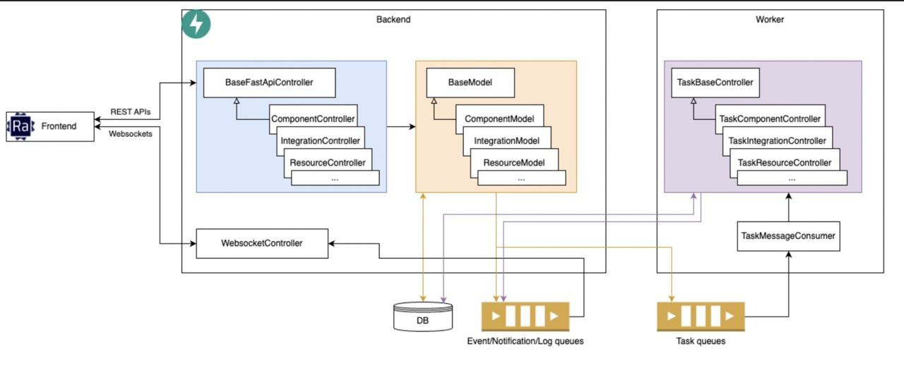
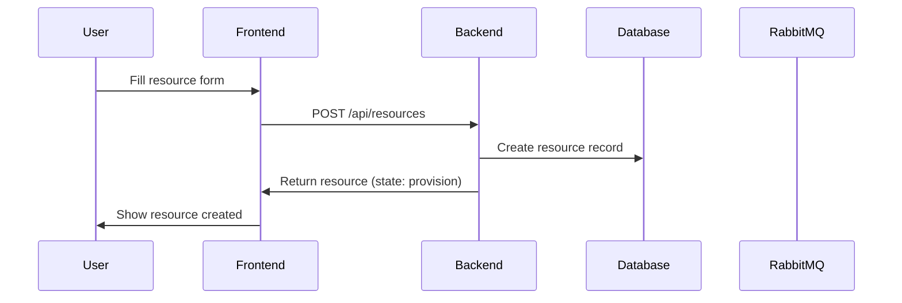
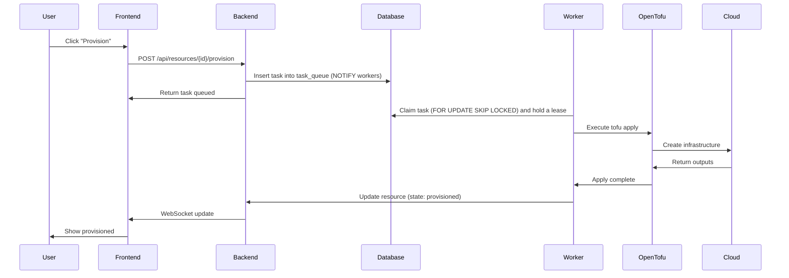
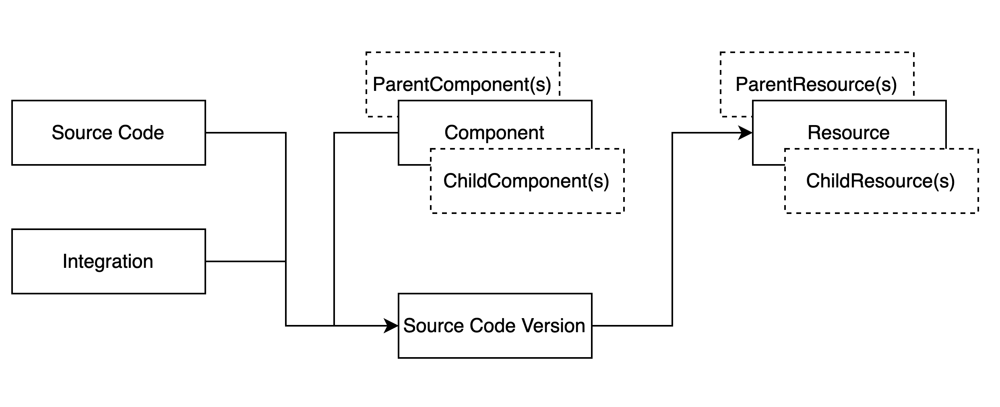
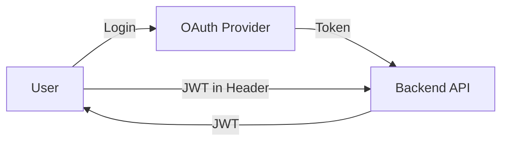

This page provides an overview of InfraKitchen's system architecture and how the components work together.

## High-Level Architecture

InfraKitchen follows a modern web application architecture with separated frontend, backend, and infrastructure layers.



### Components

- **Frontend (React/TypeScript)** - User interface for managing infrastructure
- **Backend (Python/FastAPI)** - REST API, GraphQL API, and business logic
- **PostgreSQL** - Relational database for storing infrastructure state
- **RabbitMQ** - Message broker for live events, logs and notifications
- **Worker** - Pulls infrastructure provisioning tasks from the task queue in PostgreSQL and executes them. Workers only connect outwards to the database, so any number of them can run on any node.
- **OpenTofu/Terraform** - Infrastructure-as-Code execution engine

## Request Flow

### 1. **User Creates a Resource**



### 2. **User Provisions the Resource**



### Task queue

Tasks live in the `task_queue` table. A worker claims the next queued task with `SELECT ... FOR UPDATE SKIP LOCKED`, which guarantees each task is taken by exactly one worker. At most one task runs per entity at a time.

- **Lease:** the worker holds the task with a lease (`WORKER_LEASE_SECONDS`) and extends it with heartbeats (`WORKER_HEARTBEAT_SECONDS`).
- **Worker crash:** when the lease expires, another worker reaps the task. It marks the task and its entity as failed instead of re-running a half-finished apply, so the user can retry from the UI.
- **Repeated actions:** if a user acts on an entity again while its previous task is still waiting for a worker, the waiting task is cancelled and replaced by the new one, so only the latest request runs. The user gets an in-app notification that an action was already queued. If a different user queued the replaced action, that user is notified too. Running tasks are never cancelled; the new task waits for them. Workflow tasks that target different steps don't replace each other.
- **Entity pages:** the page of a resource, executor, storage, source code, template version or workflow shows its queued and running tasks. That covers who requested each task, which worker runs it, its position in the queue, and why it is still waiting: busy workers, no online workers, a retry delay, or another task running on the same entity. This data comes in the same GraphQL request as the entity (`taskQueueStatus` field) and refreshes when the entity status changes.
- **Dependency not ready:** the task is re-queued with an increasing delay.
- **Wake-up:** idle workers wake up immediately through Postgres `LISTEN/NOTIFY`. If no notification arrives, they poll every `WORKER_POLL_INTERVAL` seconds.
- **Monitoring and scaling:** the `taskQueueStats` GraphQL query reports the backlog and worker availability.
- **Shutdown:** on `SIGTERM` a worker finishes its current task, marks itself offline and exits, which makes scaling down safe.

## Backend Module Relations

InfraKitchen's backend is organized into distinct modules with clear responsibilities:



### Module Structure

```
server/src/
├── application/          # Application layer
│   ├── resources/       # Resource management
│   ├── templates/       # Template management
│   ├── integrations/    # Integration management
│   ├── workspaces/      # Workspace sync
│   └── ...
├── graphql_api/          # GraphQL API (Strawberry)
│   ├── context.py       # Auth context & DB session
│   ├── endpoint.py      # GraphQLRouter mount
│   ├── helpers.py       # Permissions, field optimization
│   ├── schema.py        # Merged query schema
│   └── modules/         # Per-entity types, converters, queries
├── core/                # Core utilities
│   ├── adapters/        # External service adapters
│   ├── config.py        # Configuration
│   ├── database.py      # Database connection
│   └── errors.py        # Custom exceptions
│   └── ...
└── fixtures/            # Demo data
```

### Key Layers

1. **View Layer** (`*_view.py`)
      - FastAPI route handlers
      - Request/response validation
      - Authentication/authorization

2. **Service Layer** (`*_service.py`)
      - Business logic
      - Orchestration between modules
      - Transaction management

3. **CRUD Layer** (`*_crud.py`)
      - Database operations
      - Query building
      - Data access patterns

4. **Task Layer** (`*_task.py`)
      - Asynchronous operations
      - Long-running processes
      - Background jobs

5. **Model Layer** (`*_model.py`)
      - SQLAlchemy ORM models
      - Pydantic schemas
      - Data structures

6. **GraphQL Layer** (`graphql_api/`)
      - [Strawberry GraphQL](https://strawberry.rocks/) schema and types
      - Per-entity query resolvers with field-level optimization
      - Bearer token authentication via permission classes
      - See [GraphQL API](./references/graphql) for usage details

## Security Architecture

### Authentication Flow



**Supported Methods:**

- OAuth 2.0 (GitHub, Microsoft)
- Backstage integration
- Service accounts (API tokens)
- Guest access (development)

### Secrets Management

- **Encryption at Rest** - Integration credentials encrypted using Fernet
- **Environment Variables** - Runtime credentials via env vars
- **No Secrets in Logs** - Sensitive data masked
- **Audit Trail** - All changes logged

## State Machine

Resources follow a strict state machine to ensure consistency. States (`provision`, `provisioned`, `destroy`, `destroyed`) track the resource lifecycle, while statuses (`ready`, `queued`, `in_progress`, `done`, `error`, `approval_pending`, `pending`, `rejected`, `unknown`) track the current operation.

The full state constraints and status reference are documented in [Resource Workflows](concepts/resource-workflows#state-constraints).
