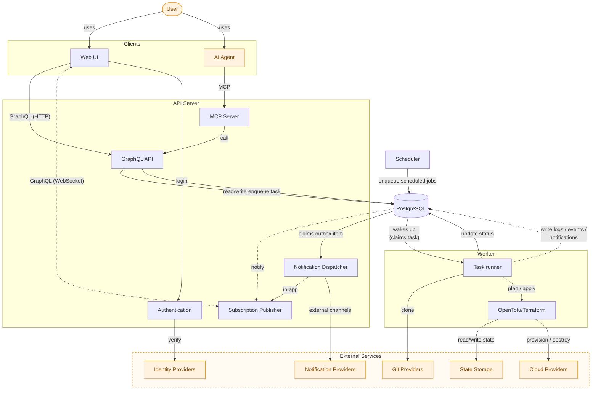
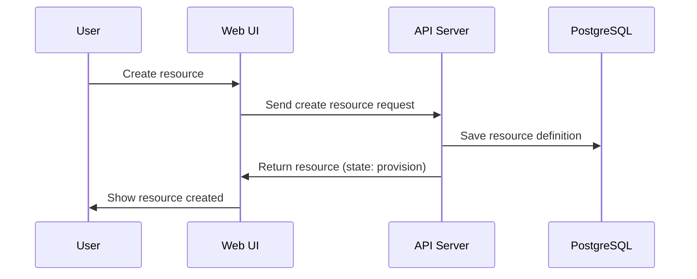
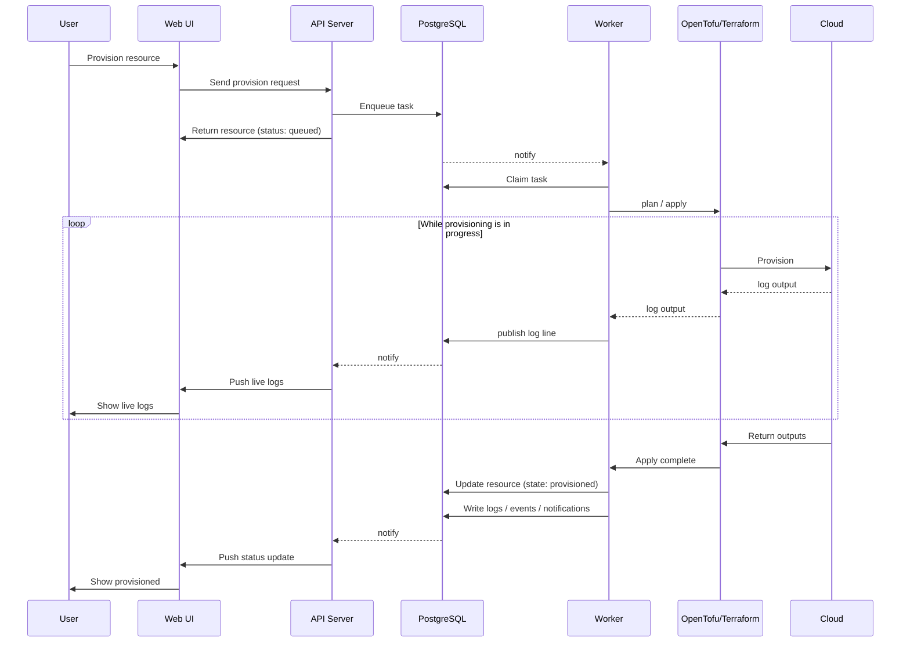
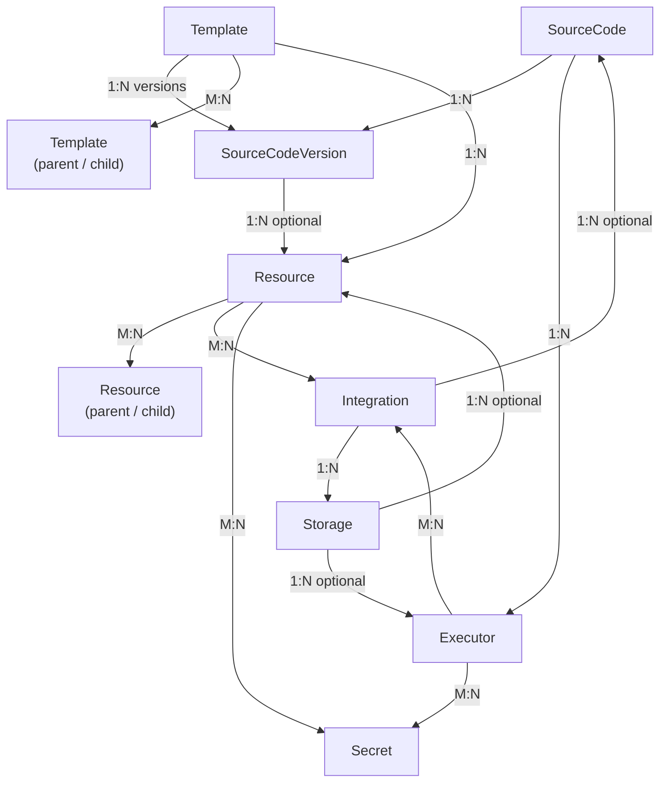

## High-Level Architecture

InfraKitchen follows a GraphQL-first architecture with a React frontend and a backend made up of three independent processes - an **API Server** (FastAPI), an asynchronous **Worker**, and a **Scheduler** - all connected through PostgreSQL (task queue, notification outbox, and `LISTEN`/`NOTIFY` pub/sub). Besides the GraphQL API consumed by the frontend, the API Server also exposes an **MCP Server** for AI agents, and integrates with external **Identity Providers** (login), **Cloud Providers** (provisioning), and **Notification Providers** (e.g. Slack).

### Components

- **User** - The person using InfraKitchen, either directly through the Web UI or indirectly through an AI agent
- **Web UI (React/TypeScript)** - User interface for managing infrastructure, talking to the backend exclusively through GraphQL (queries, mutations, and subscriptions)
- **AI Agent** - A third-party AI assistant that interacts with InfraKitchen on the user's behalf through the MCP Server
- **API Server (Python/FastAPI)** - The backend process, exposing:
  - **GraphQL API** (Strawberry) mounted at `/api/graphql` - queries, mutations, and subscriptions for the Web UI
  - **Subscription Publisher** - listens for Postgres `LISTEN`/`NOTIFY` events and pushes live updates to GraphQL subscriptions
  - **Authentication** - SSO/OIDC login routes that verify users against external Identity Providers and issue InfraKitchen JWTs
  - **MCP Server** - exposes InfraKitchen's GraphQL API and docs as MCP tools for AI agents
  - **Notification Dispatcher** - claims items from the notification outbox and routes them to in-app subscriptions or external Notification Providers
- **Scheduler** - APScheduler process that enqueues scheduled jobs and recurring entity actions into the task queue
- **Worker** - Claims tasks from the PostgreSQL task queue (woken up via `LISTEN`/`NOTIFY`, with a polling fallback) and executes the entity pipelines (provision, destroy, dry run, ...) by invoking OpenTofu/Terraform
- **OpenTofu/Terraform** - Infrastructure-as-Code execution engine, invoked by the worker through the `OtfClient` shell wrapper
- **PostgreSQL** - Relational database for storing InfraKitchen's own application data, the task queue, the notification outbox, and `LISTEN`/`NOTIFY` pub/sub for logs, events, and notifications
- **Identity Providers** - External SSO providers (Google, GitHub, Microsoft, ...) used to authenticate users
- **Cloud Providers** - External cloud platforms (AWS, GCP, Azure, ...) where infrastructure is provisioned and destroyed
- **Notification Providers** - External channels (e.g. Slack) used to deliver notifications outside the Web UI
- **Git Providers** - External Git providers (GitHub, GitLab, Bitbucket, Azure DevOps, ...) hosting the IaC templates/modules the worker clones before running OpenTofu/Terraform
- **State Storage** - External object storage (e.g. S3, GCS) used as the OpenTofu/Terraform backend for storing `.tfstate`, separate from the Cloud Providers being provisioned

## Scenarios

Two concrete scenarios show how the components above interact end-to-end.

### User Creates a Resource

Creating a resource just saves its definition — no cloud infrastructure is provisioned yet; that happens in the next scenario.

### User Provisions the Resource

Provisioning is asynchronous: the API Server enqueues a task and returns immediately, while the Worker picks it up and drives the actual OpenTofu/Terraform execution in the background.

## Domain Model

The scenarios above show how components communicate at runtime. Zooming into the data they operate on, InfraKitchen's backend is organized around a small set of core entities. They relate like this:

- **Source Code** - A Git repository reference (URL, provider, language, discovered branches/tags)
- **Source Code Version** - A pinned branch or tag of a Git repository, snapshotting the template variables and outputs configuration at that point
- **Template** - Reusable infrastructure definitions with parent/child composition, versioned through source code versions
- **Resource** - A deployed instance of a template, pinned to a specific source code version, with parent/child dependency links, integrations, secrets, storage backend, and state/status
- **Executor** - A runnable unit that pins a Git repository, integrations, secrets, and a storage backend
- **Integration** - Credentials and configuration for external providers (cloud, git, notification providers, ...)
- **Secret** - Sensitive values (e.g. API keys, passwords) attached to resources and executors
- **Storage** - Where OpenTofu/Terraform state is kept (e.g. an S3 or GCS backend), configured via an integration
