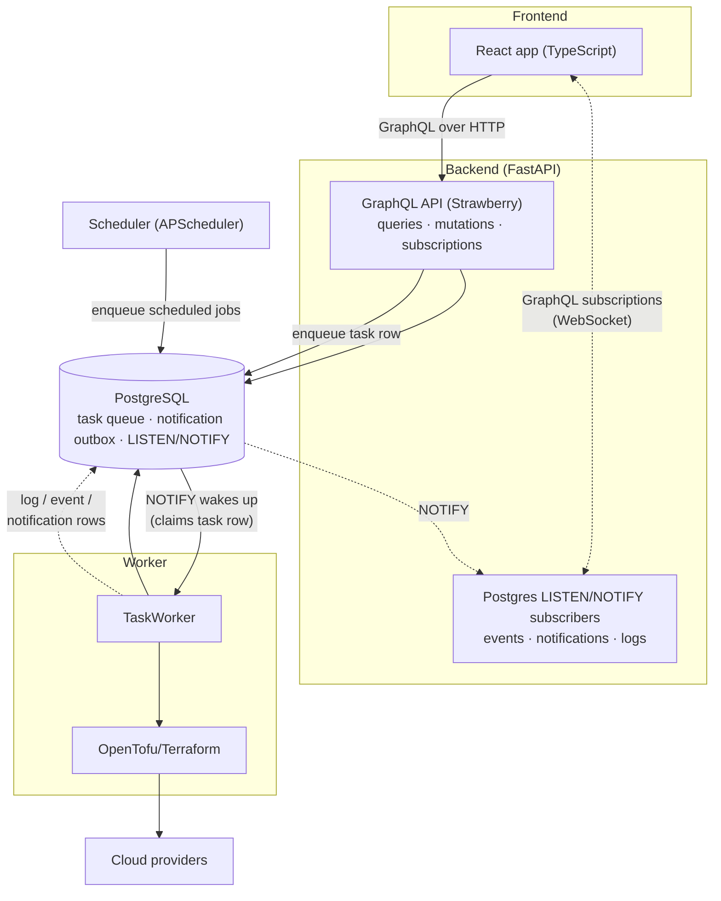
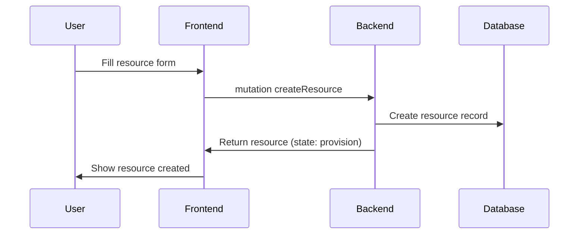
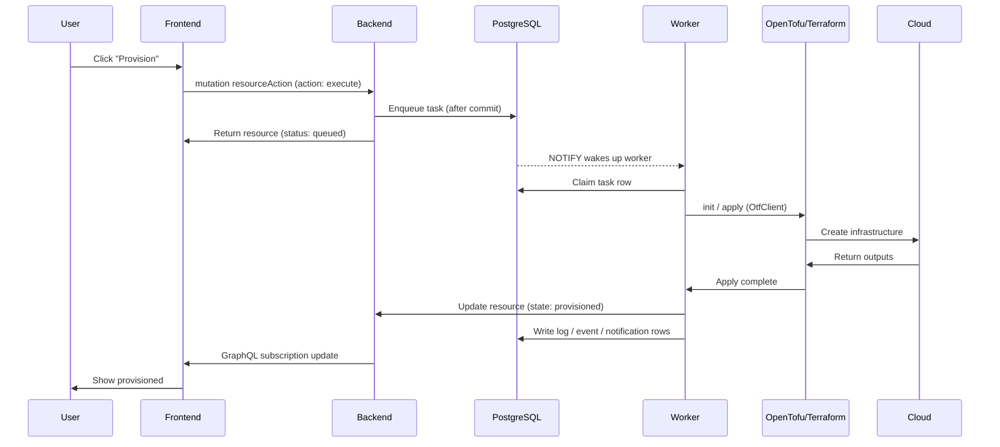
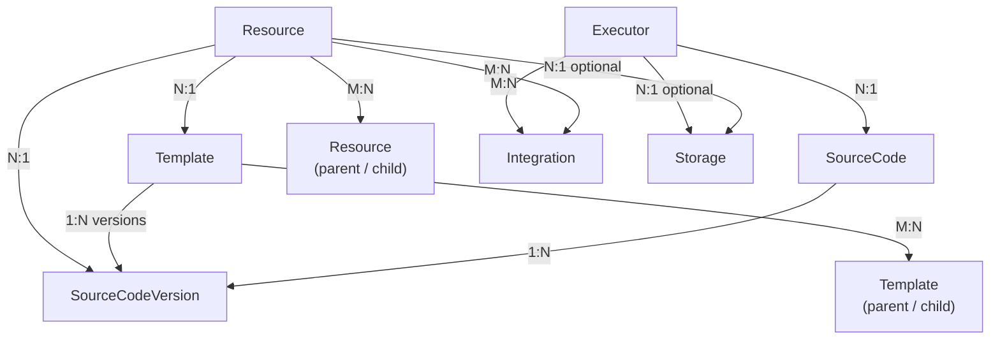
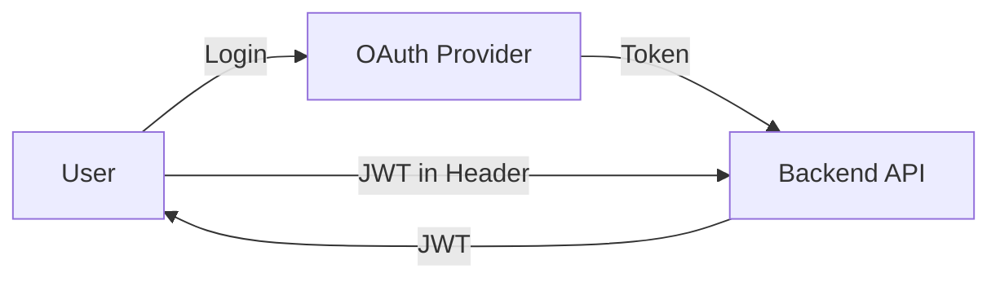

## High-Level Architecture

InfraKitchen follows a GraphQL-first architecture with a React frontend, a FastAPI backend, an asynchronous task worker, and a scheduler, all connected through PostgreSQL (task queue, notification outbox, and `LISTEN`/`NOTIFY` pub/sub).



### Components

- **Frontend (React/TypeScript)** - User interface for managing infrastructure, talking to the backend exclusively through GraphQL (queries, mutations, and subscriptions)
- **Backend (Python/FastAPI)** - GraphQL API (Strawberry) mounted at `/api/graphql`, SSO/OIDC authentication routes, MCP server, and business logic
- **Scheduler** - APScheduler process that enqueues scheduled jobs and recurring entity actions into the task queue
- **Worker** - Claims task rows from the PostgreSQL task queue (woken up via `LISTEN`/`NOTIFY`, with a polling fallback) and executes the entity pipelines (provision, destroy, dry run, ...)
- **OpenTofu/Terraform** - Infrastructure-as-Code execution engine, invoked by the worker through the `OtfClient` shell wrapper
- **PostgreSQL** - Relational database for storing infrastructure state, the task queue, the notification outbox, and `LISTEN`/`NOTIFY` pub/sub for logs, events, and notifications

## Request Flow

### User Creates a Resource



### User Provisions the Resource



## Backend Module Relations

InfraKitchen's backend is organized into domain modules with clear responsibilities. The main entities relate like this:



- **Source Code / Source Code Version** - Git repositories and their pinned branches, tags, or commits; a version snapshots the template variables and outputs configuration
- **Template** - Reusable infrastructure definitions with parent/child composition, versioned through source code versions
- **Resource** - A deployed instance of a template, with parent/child dependency links, integrations, secrets, storage backend, and state/status
- **Executor** - A runnable unit that pins a source code repository, integrations, secrets, and a storage backend
- **Integration** - Credentials and configuration for external providers (cloud, git, notification providers, ...)

### Module Structure

```
server/src/
├── application/          # Application layer, one folder per domain
│   ├── resources/        #   crud.py · service.py · model.py · schema.py · task.py
│   ├── executors/        #   same structure
│   ├── templates/        #   ...
│   ├── integrations/
│   ├── workspaces/
│   ├── workflows/
│   ├── views/            # Router mounting (auth + GraphQL)
│   ├── use_cases/        # Multi-service orchestration
│   └── ...
├── graphql_api/          # GraphQL API (Strawberry)
│   ├── context.py        # Auth context & DB session
│   ├── endpoint.py       # GraphQLRouter mount
│   ├── helpers.py        # Permissions, field optimization
│   ├── schema.py         # Merged query schema
│   └── modules/          # Per-entity types, converters, queries, mutations, subscriptions
├── core/                 # Core utilities and shared domains
│   ├── adapters/         # External service adapters
│   ├── config.py         # Configuration
│   ├── database.py       # Database connection
│   ├── base_models.py    # Base / BaseEntity / BaseModel / MessageModel
│   ├── errors.py         # Custom exceptions
│   └── ...
├── worker.py             # Task worker entrypoint (claims rows from the Postgres task queue)
├── scheduler.py          # Scheduler entrypoint (APScheduler)
├── app.py                # FastAPI app entrypoint
└── fixtures/             # Demo data
```

### Key Layers

1. **GraphQL Layer** (`graphql_api/`)
      - [Strawberry GraphQL](https://strawberry.rocks/) schema and types
      - Queries, mutations, and subscriptions per entity
      - Bearer token authentication via permission classes
      - See [GraphQL API](./references/graphql) for usage details

2. **Service Layer** (`*_service.py`)
      - Business logic
      - Orchestration between modules
      - Transaction management, publishing task/event messages

3. **CRUD Layer** (`*_crud.py`)
      - Database operations
      - Query building
      - Data access patterns

4. **Task Layer** (`*_task.py`)
      - Asynchronous operations executed by the worker
      - Long-running processes (provisioning, destroying, dry runs)
      - Pipeline orchestration per entity

5. **Model Layer** (`*_model.py`)
      - SQLAlchemy ORM models (extending `BaseEntity` / `BaseRevision`)
      - Pydantic DTOs and schemas
      - Data structures

## Security Architecture

### Authentication Flow



**Supported Methods:**

- OAuth 2.0 (GitHub, Microsoft, Google)
- Backstage integration
- Service accounts (API tokens)
- Guest access (development)

### Secrets Management

- **Encryption at Rest** - Integration credentials encrypted using Fernet
- **Environment Variables** - Runtime credentials via env vars
- **No Secrets in Logs** - Sensitive data masked
- **Audit Trail** - All changes logged

## State Machine

Resources follow a strict state machine to ensure consistency. States (`provision`, `provisioned`, `destroy`, `destroyed`) track the resource lifecycle, while statuses (`ready`, `queued`, `in_progress`, `done`, `error`, `approval_pending`, `pending`, `rejected`, `cancelled`, `unknown`) track the current operation.

The full state constraints and status reference are documented in [Resource Workflows](concepts/resource-workflows#state-constraints).
