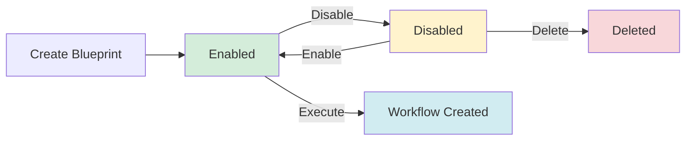
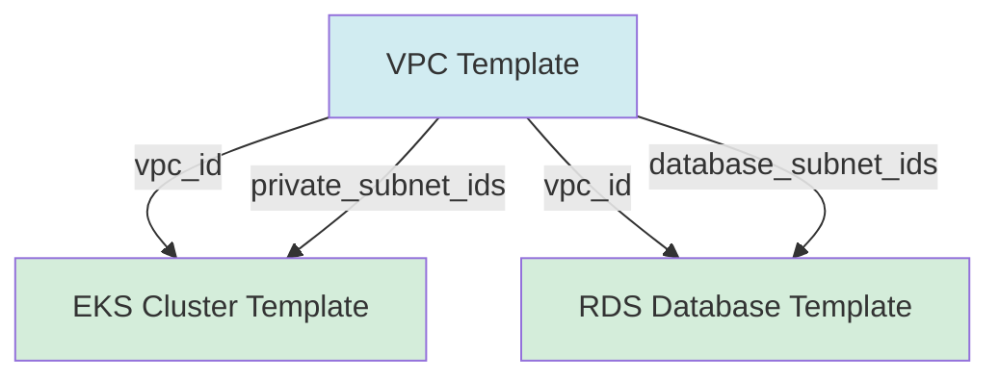

# Blueprints

In InfraKitchen, **Blueprints** are reusable definitions that combine multiple Templates into a single, executable plan. A Blueprint describes which infrastructure components to provision and how their outputs wire together — turning a multi-resource stack into a one-click operation.

Blueprints are the recipes in your infrastructure kitchen — they define the ingredients (templates), the order of preparation (dependency graph), and the connections between components (wiring rules), so you can reliably reproduce entire environments.

A blueprint combines:

- **Templates** (ordered list of infrastructure components)
- **Wiring Rules** (how outputs from one template feed into inputs of another)
- **Default Variables** (pre-configured values per template)
- **Configuration** (general settings for the blueprint)
- **Labels** (tags for organizing and filtering)

When executed, a blueprint creates a [Workflow](../workflows/overview.md) that provisions each resource in the correct dependency order.

---

## ♻️ Blueprint Lifecycle

Blueprints move through these stages: **Create → Enable/Disable → Delete**.

**Statuses:** `enabled`, `disabled`

Unlike Resources or Executors, blueprints are configuration entities — they define *what* to build, not running infrastructure. They can be executed multiple times, each execution creating a new Workflow.



---

## 📋 Blueprint Properties

Each blueprint in InfraKitchen contains the following core properties:

| Property              | Description                                         | Notes                                      |
| :-------------------- | :-------------------------------------------------- | :----------------------------------------- |
| **Name**              | Unique identifier for the blueprint                 | Must be unique                             |
| **Description**       | Detailed information about the blueprint            | Markdown supported                         |
| **Templates**         | Ordered list of templates included in the blueprint | At least one required                      |
| **Wiring Rules**      | Output → input mappings between templates           | Defines the dependency graph               |
| **Default Variables** | Pre-configured variable values per template         | Keyed by template ID                       |
| **Configuration**     | General blueprint settings                          | Integration defaults, workspace, etc.      |
| **Labels**            | Tags for organizing and filtering                   | E.g., `production`, `networking`, `data`   |
| **Status**            | Current blueprint status                            | `enabled` or `disabled`                    |
| **Revision Number**   | Version tracking for blueprint changes              | Auto-incremented on updates                |
| **Creator**           | User who created the blueprint                      | Used for permissions and audit             |

---

## ➕ Creating Blueprints

Blueprints are created to define repeatable multi-resource infrastructure stacks.

### Creation Steps

1. Navigate to **Blueprints** in the sidebar
2. Click **Create**
3. Configure basic properties:
    - Enter unique name
    - Add description explaining the blueprint's purpose
4. Select templates:
    - Choose the templates that make up the blueprint
    - Order them logically (the system will compute execution order from wiring)
5. Define wiring rules:
    - Map outputs from source templates to inputs on target templates
    - The wiring canvas provides a visual editor for creating connections
6. Set default variables:
    - Configure default variable values per template
    - These can be overridden at execution time
7. Add labels for organization
8. Click **Save**

!!! tip "When to Use Blueprints"
    Use blueprints for:

    - **Multi-tier environments** — VPC + EKS + RDS in one click
    - **Standardized stacks** — Repeatable patterns across teams
    - **Connected infrastructure** — Components that depend on each other's outputs
    - **Environment replication** — Dev, staging, production from the same definition

    Use direct Resource creation for:

    - Single, standalone resources
    - One-off infrastructure with no dependencies

---

## 🔗 Wiring Rules

Wiring rules are the core mechanism that makes blueprints powerful. They define how the output of one template's resource automatically feeds into the input variable of another template's resource.

### Wiring Rule Structure

Each wiring rule contains four fields:

| Field                  | Description                                    |
| :--------------------- | :--------------------------------------------- |
| **Source Template ID** | Template whose resource produces the output    |
| **Source Output**      | Name of the output variable on the source      |
| **Target Template ID** | Template whose resource consumes the value     |
| **Target Variable**   | Name of the input variable on the target       |

### Example

```yaml
Blueprint: Production Environment
Templates:
  - VPC Template
  - EKS Cluster Template
  - RDS Database Template

Wiring Rules:
  - source: VPC Template.vpc_id → target: EKS Cluster Template.vpc_id
  - source: VPC Template.private_subnet_ids → target: EKS Cluster Template.subnet_ids
  - source: VPC Template.vpc_id → target: RDS Database Template.vpc_id
  - source: VPC Template.database_subnet_ids → target: RDS Database Template.subnet_ids
```

### Dependency Graph

The wiring rules automatically create a directed acyclic graph (DAG) that determines execution order:



Templates with no incoming dependencies execute first. Templates at the same level (no dependencies on each other) can execute in parallel.

!!! warning "Circular Dependencies"
    Wiring rules must not create circular dependencies. If template A depends on template B and template B depends on template A, the blueprint cannot be executed. The system validates this and raises an error.

---

## 🔧 Managing Blueprints

Blueprints support lifecycle actions based on their current status.

| Action      | When Available       | Description                                   |
| :---------- | :------------------- | :-------------------------------------------- |
| **Edit**    | Status: `enabled`    | Modify blueprint configuration                |
| **Disable** | Status: `enabled`    | Prevent new executions                        |
| **Enable**  | Status: `disabled`   | Allow executions again                        |
| **Delete**  | Status: `disabled`   | Permanently remove the blueprint              |
| **Execute** | Status: `enabled`    | Create a new workflow from this blueprint      |

!!! info "Disabling Before Deleting"
    Blueprints must be disabled before they can be deleted. This prevents accidental deletion of actively used blueprints.

---

## ▶️ Executing Blueprints

When a blueprint is executed, the system creates a [Workflow](../workflows/overview.md) that orchestrates resource provisioning.

### Execution Options

At execution time, you can customize the workflow with:

| Option                        | Description                                           |
| :---------------------------- | :---------------------------------------------------- |
| **Variable Overrides**        | Override default variables per template               |
| **Integration IDs**           | Cloud credentials shared across all resources         |
| **Secret IDs**                | Sensitive data shared across all resources             |
| **Storage ID**                | Backend for Terraform/OpenTofu state                   |
| **Source Code Version Overrides** | Use specific code versions per template           |
| **Parent Overrides**          | Specify parent resources for templates with external parents |

### What Happens During Execution

1. **Topological sort** — templates are ordered by their wiring dependencies
2. **Variable merge** — for each step: blueprint defaults → wired outputs → runtime overrides
3. **Workflow creation** — a workflow is created with one step per template
4. **Blueprint link** — the workflow is associated with the originating blueprint
5. **Execution** — the workflow processes steps in dependency order

### Variable Resolution Order

Variables for each step are resolved with this priority (highest wins):

```
┌─────────────────────────────┐
│  3. Runtime Overrides       │  ← Highest priority
├─────────────────────────────┤
│  2. Wired Outputs           │  ← From completed upstream steps
├─────────────────────────────┤
│  1. Blueprint Defaults      │  ← From blueprint configuration
└─────────────────────────────┘
```

---

## 📊 Blueprint Workflows

Each blueprint execution creates a workflow that can be tracked independently. The blueprint detail page shows all workflows created from it, with their status and step progress.

### Workflow Tracking

From a blueprint's detail page you can:

- View all past and current executions
- See the status of each workflow (pending, in progress, done, error)
- Drill into individual workflows to see step-level progress
- Navigate to resources created by completed steps

---

## 🔐 Blueprint Permissions

Blueprint actions are controlled by role-based access control:

| Action         | Permission Required |
| :------------- | :------------------ |
| **View**       | Read access         |
| **Create**     | Write access        |
| **Edit**       | Admin access        |
| **Disable**    | Admin access        |
| **Enable**     | Admin access        |
| **Delete**     | Admin access        |
| **Execute**    | Write access        |

---

## 🔗 Blueprints vs Templates vs Executors

Understanding when to use each:

| Feature               | Blueprint                               | Template                        | Executor                         |
| :-------------------- | :-------------------------------------- | :------------------------------ | :------------------------------- |
| **Purpose**           | Multi-resource orchestration plan       | Reusable infrastructure pattern | One-time task execution          |
| **Reusability**       | Executed multiple times                 | Instantiated as resources       | Not reusable                     |
| **Dependencies**      | Automatic via wiring rules              | Parent-child hierarchy          | None                             |
| **Variable Passing**  | Automated output → input               | Manual per resource             | Defined in source code           |
| **Common Uses**       | Environment stacks, multi-tier apps     | VPCs, clusters, databases       | Migrations, imports, cleanup     |

**Decision Guide:**

- ✅ Use **Blueprint**: "I need to provision a VPC, EKS, and RDS with automatic output wiring"
- ✅ Use **Template**: "I need a reusable definition for a VPC that teams can instantiate"
- ✅ Use **Executor**: "I need to run a one-time database migration"

---

## 🚀 Best Practices

### Blueprint Design

- Keep blueprints focused — one blueprint per logical environment or stack
- Use descriptive names that indicate purpose and scope
- Document the blueprint's purpose and expected inputs in the description
- Minimize the number of wiring rules — keep the dependency graph shallow

### Naming Conventions

Use descriptive names that indicate purpose and scope:

```
✅ Good:
- production-networking-stack
- eks-with-monitoring
- data-platform-tier

❌ Avoid:
- blueprint-1
- test
- my-stack
```

### Wiring Design

- Wire only the outputs that downstream templates actually need
- Avoid unnecessary transitive dependencies
- Test wiring with a non-production execution first
- Document which outputs each template produces in the template description

### Default Variables

- Set default variables for values that are consistent across executions
- Use runtime overrides for environment-specific values (regions, CIDR blocks)
- Document which variables should be overridden at execution time

---

## 📚 Related Documentation

- [Core Concepts Overview](../overview.md)
- [Workflows Documentation](../workflows/overview.md)
- [Templates Documentation](../templates/overview.md)
- [Resources Documentation](../resources/overview.md)
- [Executors Documentation](../executors/overview.md)
- [Integrations](../../integrations/overview.md)
- [Secrets Management](../../secrets/overview.md)
