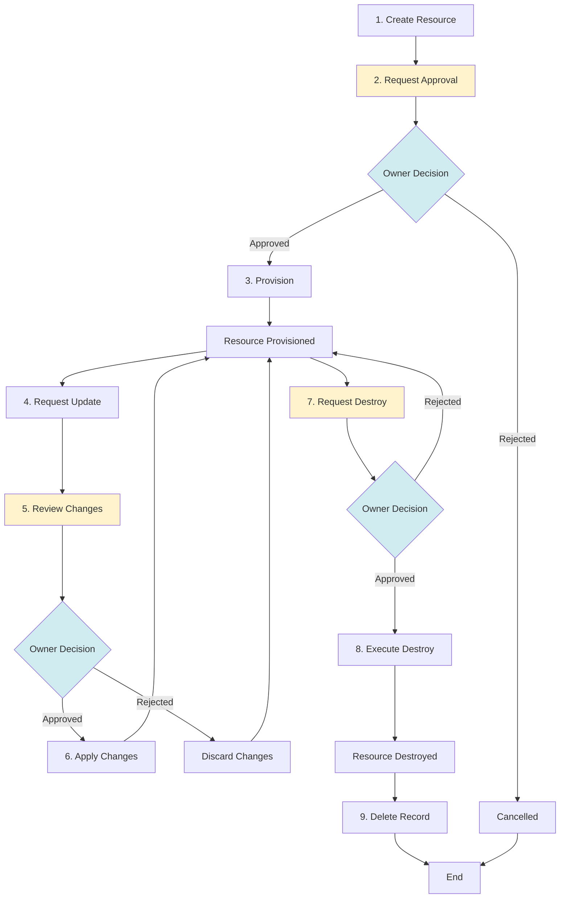
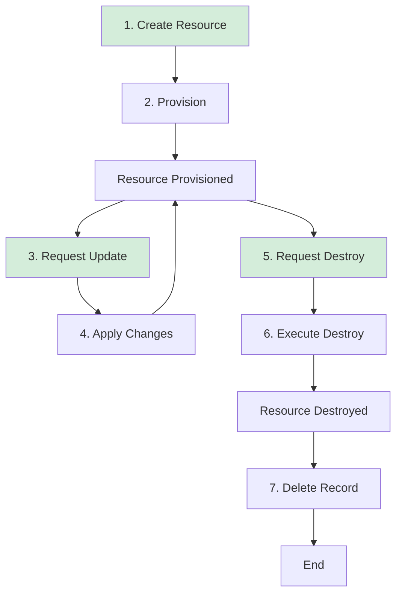
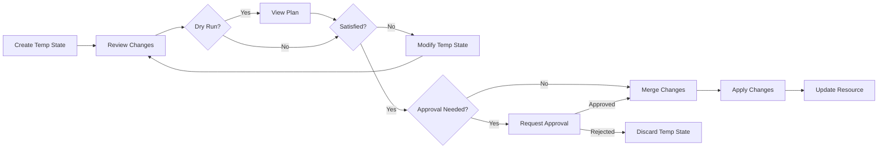

# Resource Workflows

This document details the technical workflows for infrastructure resources in InfraKitchen. For high-level concepts and UI instructions, see the [Resources Overview](overview.md).

---

## 📊 Workflow Overview

The resource workflow consists of primary steps that guide a resource from creation to deletion. The workflow differs based on whether the approval flow feature is enabled or disabled.

### With Approval Flow Enabled

When approval flow is enabled, all provisioning, update, and destroy operations require explicit approval from resource owners before execution:



### With Approval Flow Disabled

When approval flow is disabled, operations execute automatically after being requested, providing faster deployment cycles:



---

## 1️⃣ Create

The Create step initializes a new resource in InfraKitchen's database without provisioning any actual infrastructure yet.

### What Happens

- Validates configuration (name, template, variables)
- Checks parent resources are in `provisioned` state
- Inherits dependency tags and configs from parent resources
- Set initial state to `provision`
- Set initial status to `ready`
- Create resource record in database
- Initialize revision number to 1
- Assign permissions based on creator

### Prerequisites

- Template must exist and be enabled
- Parent resources must be `provisioned`
- Required variables must be provided
- Cloud integrations must be configured (for non-abstract resources)

### Dependency Inheritance

When a resource is created, it automatically inherits from its parents:

**Dependency Tags:**

- Tags with `inherited_by_children: true` are copied from all parent resources
- Multiple parents contribute tags (child receives union of all parent tags)

**Dependency Configs:**

- Configs with `inherited_by_children: true` are used as default variable values
- When creating a resource, if a variable name matches a parent config name, the config value pre-populates the variable field
- User can override inherited config values during resource creation

### State Transitions

- **Before**: N/A
- **Final**: State `provision`, Status: `ready`

### Validation Checks

1. **Name uniqueness**: Name must be unique within template and source code version
2. **Parent compatibility**: Parents must match template's parent templates
3. **Variable validation**: All required variables must have valid values
4. **Frozen variables**: Values for frozen variables cannot be changed later
5. **Unique variables**: Values for unique variables must be unique across resources
6. **Storage path**: Must be unique and follow naming conventions

---

## 2️⃣ Approval (Conditional)

The Approval step is only active when the "Approval Flow" feature flag is enabled. It provides a manual review and approval gate before provisioning.

### When Triggered

- **Create flow**: After resource creation, before provisioning
- **Update flow**: After update request, before applying changes
- **Destroy flow**: After destroy request, before executing destruction

### What Happens

- Sets status to `approval_pending`
- Notifies resource owner
- Waits for owner decision
- Records approval/rejection decision
- Updates status based on decision

### Approval Roles

| Role      | Can Approve | Can Request | Can View |
| :-------- | :---------- | :---------- | :------- |
| **Owner** | ✅          | ✅          | ✅       |
| **Admin** | ✅          | ✅          | ✅       |
| **Write** | ❌          | ✅          | ✅       |
| **Read**  | ❌          | ❌          | ✅       |

### State Transitions

**If Approved**:

- Status: `approval_pending` → `ready`
- Workflow continues to next step

**If Rejected**:

- Status: `approval_pending` → `rejected`
- Workflow stops, resource remains in current state

---

## 3️⃣ Provision

The Provision step executes the actual infrastructure as code to create resources in the cloud environment.

### What Happens

1. Sets status to `in_progress`
2. Fetches cloud integration credentials
3. Initializes Terraform/OpenTofu backend
4. Downloads source code from Git
5. Prepares variable files
6. Executes `terraform apply` or `tofu apply`
7. Extracts outputs from state file
8. Sets state to `provisioned` and status to `done`

### Prerequisites

- Resource must be in `provision` state with `ready` status
- If approval flow enabled, resource must be approved
- Parent resources must be in `provisioned` state
- Cloud integrations must be valid
- Storage backend must be accessible
- Source code must be valid Terraform/OpenTofu

### Dry Run (Plan)

Before provisioning, you can perform a dry run:

```bash
# InfraKitchen executes:
terraform init
terraform plan -out=plan.tfplan
```

The plan shows:

- Resources to be created
- Resources to be changed
- Resources to be destroyed
- Estimated changes

### State Transitions

- **Before**: State: `provision`, Status: `ready`
- **During**: State: `provision`, Status: `in_progress`
- **Success**: State: `provisioned`, Status: `done`
- **Failure**: State: `provision`, Status: `error`

### Execution Environment

The provision operation runs in an isolated environment with:

- Terraform/OpenTofu CLI
- Cloud provider CLI tools (aws-cli, az, gcloud)
- Git for source code checkout
- Environment variables from integrations
- Backend configuration for state storage

### Output Extraction

After successful provisioning, InfraKitchen extracts outputs:

```hcl
# In Terraform code
output "vpc_id" {
  description = "The ID of the VPC"
  value       = aws_vpc.main.id
}

output "subnet_ids" {
  description = "List of subnet IDs"
  value       = aws_subnet.private[*].id
}
```

These outputs are stored in the resource and can be:

- Referenced by child resources
- Used in dependency configs

### Example Execution Log

```
[2025-10-20 10:00:00] Starting provision for resource: vpc-production-us-east-1
[2025-10-20 10:00:01] Fetching cloud integration: aws-production
[2025-10-20 10:00:02] Initializing Terraform backend
[2025-10-20 10:00:05] Terraform initialized successfully
[2025-10-20 10:00:06] Downloading source code version: v1.2.0
[2025-10-20 10:00:08] Preparing variable file
[2025-10-20 10:00:09] Executing terraform apply
[2025-10-20 10:00:10] Creating aws_vpc.main
[2025-10-20 10:02:15] aws_vpc.main: Creation complete (ID: vpc-0123456789abcdef)
[2025-10-20 10:02:16] Creating aws_subnet.private[0]
[2025-10-20 10:02:30] aws_subnet.private[0]: Creation complete (ID: subnet-111)
[2025-10-20 10:02:31] Apply complete! Resources: 2 added, 0 changed, 0 destroyed
[2025-10-20 10:02:32] Extracting outputs
[2025-10-20 10:02:33] Provision completed successfully
```

### Error Handling

If provisioning fails:

1. Error is captured and logged
2. Status set to `error`
3. State remains `provision`
4. User can review logs
5. Fix issues and retry

---

## 4️⃣ Update

The Update step modifies an existing provisioned resource. InfraKitchen uses a temporary state mechanism to safely preview and apply changes.

### What Happens

1. Creates temporary state with proposed changes
2. User reviews changes in temporary state
3. Optionally perform dry run on temporary state
4. If approval flow: requests approval
5. Merges temporary state to main resource
6. Executes Terraform/OpenTofu apply
7. Updates outputs
8. Increments revision number

### Temporary State Workflow

!!! info "Update Process"
    Updates create a temporary state for review. You can preview changes before applying.



### State Transitions

- **Before**: State: `provisioned`, Status: `done`
- **Temp State Created**: Status: `pending` (for temp state)
- **During Apply**: State: `provisioned`, Status: `in_progress`
- **Success**: State: `provisioned`, Status: `done`, Revision++
- **Failure**: State: `provisioned`, Status: `error`

### What Can Change

✅ **Updatable:** Description, source code version, variables (except frozen), integrations, labels, workspace

❌ **Immutable:** Name, template, storage backend, storage path

!!! warning "Source Code Version Updates"
    Changing the source code version will update the available variables. Ensure compatibility and test in non-production environments first.

### Frozen Variables

Variables marked as `frozen: true` cannot be changed after initial provisioning. Attempting to change them results in a validation error.

!!! note "Discarded States"
    Discarded temporary states are permanently deleted and cannot be recovered.

---

## 5️⃣ Recreate

The Recreate step makes it possible to re-provision a resource that has been previously rejected or destroyed.

### What Happens

1. Sets state to `provision` and status to `ready`
2. If approval flow enabled: requests approval
3. Sets status to `in_progress`
4. Executes `terraform apply`
5. Extracts new outputs
6. Updates resource record
7. Increments revision number

### State Transitions

- **Before**: State: `destroyed`, Status: `done` OR State: `provision`, Status: `rejected`
- **Initiated**: State: `provision`, Status: `ready`
- **During Provision**: State: `provision`, Status: `in_progress`
- **Success**: State: `provisioned`, Status: `done`
- **Failure**: State: `provision`, Status: `error`

---

## 6️⃣ Destroy

The Destroy step removes infrastructure from the cloud provider while keeping the resource record in InfraKitchen.

### What Happens

1. Validates no child resources exist in `provisioned` state
2. Sets state to `destroy` and status to `ready`
3. If approval flow: request approval
4. Sets status to `in_progress`
5. Executes `terraform destroy`
6. Removes all cloud resources
7. Sets state to `destroyed` and status to `done`
8. Clears outputs

### Prerequisites

- Resource must be in `provisioned` state
- No child resources in `provisioned` state
- User must have admin permissions

### Dependency Checks

Before destroying, InfraKitchen verifies:

1. **Children in wrong state**: Checks if any children are not `destroyed`
2. **Dependencies exist**: Checks for resources that depend on this resource's outputs

If dependencies exist, destroy is blocked with error:

```json
{
  "error": "Cannot destroy resource",
  "reason": "Dependencies exist",
  "dependencies": [
    {
      "resource_id": "child-resource-id",
      "resource_name": "eks-cluster-production",
      "state": "provisioned"
    }
  ]
}
```

### State Transitions

- **Before**: State: `provisioned`, Status: `done`
- **Initiated**: State: `destroy`, Status: `ready`
- **During**: State: `destroy`, Status: `in_progress`
- **Success**: State: `destroyed`, Status: `done`
- **Failure**: State: `destroy`, Status: `error`

### Example Execution

```
[2025-10-20 15:00:00] Starting destroy for resource: vpc-staging-us-west-2
[2025-10-20 15:00:01] Checking for child resources
[2025-10-20 15:00:02] No active children found
[2025-10-20 15:00:03] Fetching cloud integration: aws-staging
[2025-10-20 15:00:04] Initializing Terraform backend
[2025-10-20 15:00:07] Executing terraform destroy
[2025-10-20 15:00:08] Destroying aws_subnet.private[1]
[2025-10-20 15:01:20] aws_subnet.private[1]: Destruction complete
[2025-10-20 15:01:21] Destroying aws_subnet.private[0]
[2025-10-20 15:02:35] aws_subnet.private[0]: Destruction complete
[2025-10-20 15:02:36] Destroying aws_vpc.main
[2025-10-20 15:04:10] aws_vpc.main: Destruction complete
[2025-10-20 15:04:11] Destroy complete! Resources: 0 added, 0 changed, 3 destroyed
[2025-10-20 15:04:12] Clearing outputs
[2025-10-20 15:04:13] Destroy completed successfully
```

### Error Handling

Common destroy errors:

- **Dependencies exist**: Other resources still using this resource
- **Resource in use**: Cloud provider preventing deletion (e.g., VPC with ENIs)
- **Permission denied**: Insufficient IAM/RBAC permissions
- **Resource not found**: Already deleted outside of InfraKitchen

---

## 7️⃣ Delete

The Delete step permanently removes the resource record from InfraKitchen's database.

### What Happens

1. Verifies resource in `destroyed` state
2. Removes permissions
3. Archives audit logs
4. Deletes database record
5. Removes parent/child relationships

### Prerequisites

- Resource must be in `destroyed` state
- User must have admin permissions
- All temporary states must be resolved

### What Gets Deleted

- Resource metadata and configuration
- Variable values
- Parent/child relationships
- Labels and tags
- Revision history

### What Is Preserved

- Audit logs (archived)
- Historical activity logs
- Reference in other resources' history (as "deleted resource")

### State Transitions

- **Before**: State: `destroyed`, Status: `done`
- **Final**: Resource deleted, no longer exists

### Irreversibility

!!! danger "Permanent Deletion"
    Delete operation is permanent and cannot be undone. The resource cannot be recovered after deletion. If you need to recreate the infrastructure, you must create a new resource from scratch.

### When to Delete

- Cleanup after decommissioning
- Removing test resources
- Archiving old infrastructure records
- Reducing clutter in resource list

### When Not to Delete

- Resource might be needed for reference
- Audit requirements mandate retention
- Historical context is valuable
- Rollback might be needed

---

## ⚠️ State Constraints

| Current State   | Allowed Next States              | Available Actions          |
| :-------------- | :------------------------------- | :------------------------- |
| **provision**   | `provisioned`, `provision`       | Provision, Retry, Recreate |
| **provisioned** | `provisioned`, `destroy`         | Update, Destroy            |
| **destroy**     | `destroyed`, `provisioned`       | Execute, Cancel            |
| **destroyed**   | `provision`, (none - for delete) | Recreate, Delete           |

---

## 📈 Status Tracking

Resource statuses provide real-time operation state:

| Status               | Meaning                     | Available User Actions |
| :------------------- | :-------------------------- | :--------------------- |
| **ready**            | Ready for next operation    | Execute action         |
| **queued**           | Waiting in execution queue  | Wait                   |
| **in_progress**      | Currently executing         | Monitor logs           |
| **done**             | Successfully completed      | View results           |
| **error**            | Failed with error           | Review logs, retry     |
| **approval_pending** | Awaiting owner approval     | Approve/reject         |
| **pending**          | Waiting for prerequisite    | Check dependencies     |
| **rejected**         | Approval was rejected       | Modify and resubmit    |
| **unknown**          | Status cannot be determined | Check system health    |

---

## 🔀 Workflow Variations

### Abstract Resources

Abstract resources skip provisioning steps:

1. Create (no provision step)
2. Update metadata, tags, and configs only
3. Delete (no destroy needed)

### Resources Without Approval Flow

When approval flow is disabled:

1. Create → Provision (automatic)
2. Update → Apply (automatic)
3. Destroy → Execute (automatic)
