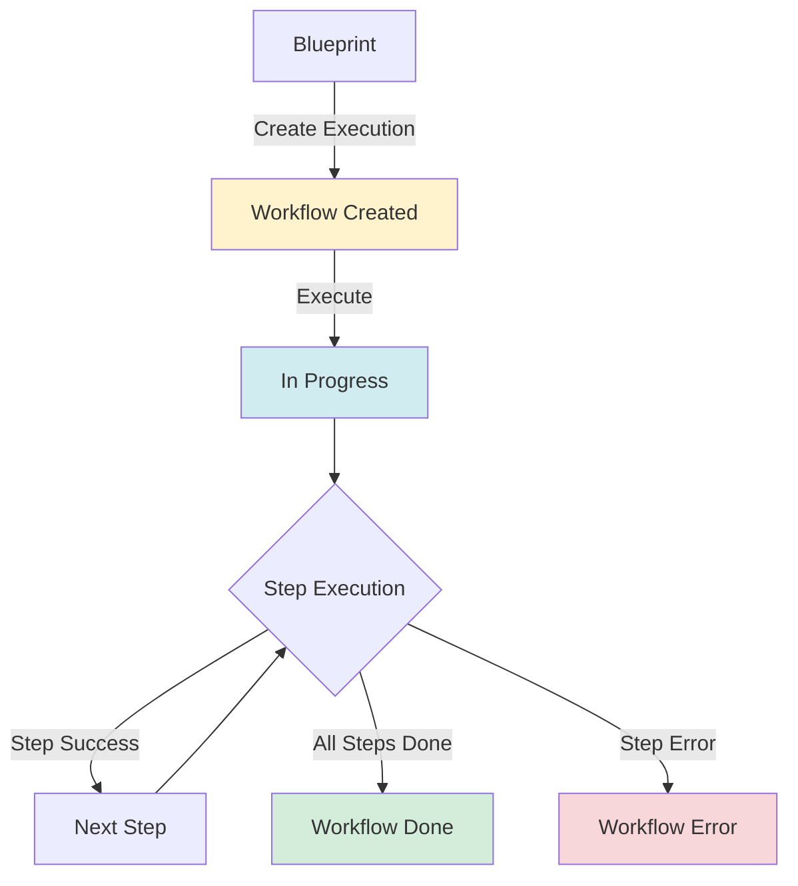

# Workflows

In InfraKitchen, **Workflows** are automated execution plans that orchestrate the provisioning of multiple resources in the correct dependency order. Workflows are created from Blueprints and handle the complexity of wiring outputs from one resource into the inputs of another.

Workflows are the orchestration layer in your infrastructure kitchen — they take a Blueprint's definition of what needs to be built and execute it step-by-step, resolving dependencies, passing outputs between resources, and tracking progress throughout the process.

A workflow combines:

- **Steps** (ordered list of resource provisioning tasks)
- **Wiring Snapshot** (captured dependency rules from the blueprint)
- **Variable Overrides** (runtime customizations per template)
- **Integrations** (cloud credentials shared across all steps)
- **Secrets** (sensitive data shared across all steps)
- **Storage** (backend for Terraform/OpenTofu state)

Once executed, workflows provision resources in topological order — ensuring that upstream resources are created before downstream resources that depend on their outputs.

---

## ♻️ Workflow Lifecycle

Workflows move through these stages: **Create → Execute → Complete/Error**.

**Statuses:** `pending`, `in_progress`, `done`, `error`

Each workflow step also maintains its own status, allowing granular tracking of multi-resource provisioning.



---

## 📋 Workflow Properties

Each workflow in InfraKitchen contains the following core properties:

| Property               | Description                                         | Notes                                     |
| :--------------------- | :-------------------------------------------------- | :---------------------------------------- |
| **ID**                 | Unique identifier for the workflow                  | Auto-generated UUID                       |
| **Status**             | Current execution status                            | `pending`, `in_progress`, `done`, `error` |
| **Error Message**      | Description of failure if status is `error`         | Only present on failure                   |
| **Steps**              | Ordered list of provisioning tasks                  | One per template in the blueprint         |
| **Wiring Snapshot**    | Copy of blueprint wiring rules at execution time    | Immutable after creation                  |
| **Variable Overrides** | Runtime variable customizations per template        | Merged with blueprint defaults            |
| **Creator**            | User who triggered the execution                    | Used for permissions and audit            |
| **Started At**         | Timestamp when execution began                      | Set when first step starts                |
| **Completed At**       | Timestamp when execution finished                   | Set on success or failure                 |
| **Created At**         | Timestamp when the workflow was created             | Set on creation                           |

---

## 📋 Workflow Step Properties

Each step within a workflow tracks the provisioning of a single resource:

| Property                | Description                                        | Notes                                     |
| :---------------------- | :------------------------------------------------- | :---------------------------------------- |
| **ID**                  | Unique identifier for the step                     | Auto-generated UUID                       |
| **Template**            | The template this step provisions                  | From the blueprint's template list        |
| **Resource**            | The resource created by this step                  | Populated after successful provisioning   |
| **Position**            | Execution order (BFS level)                        | Steps at the same level can run in parallel |
| **Status**              | Current step status                                | `pending`, `in_progress`, `done`, `error` |
| **Error Message**       | Description of failure if step errored             | Only present on failure                   |
| **Resolved Variables**  | Final merged variables for this step               | Defaults + wired outputs + overrides      |
| **Parent Resources**    | Resources that this step depends on                | From template hierarchy or overrides      |
| **Cloud Integrations**  | Cloud provider credentials for this step           | Shared from workflow request              |
| **Secrets**             | Sensitive data for this step                       | Shared from workflow request              |
| **Source Code Version** | Specific code version for this step                | Can be overridden per template            |
| **Storage**             | Backend for Terraform/OpenTofu state               | Shared from workflow request              |
| **Started At**          | Timestamp when step execution began                | Set when step starts                      |
| **Completed At**        | Timestamp when step execution finished             | Set on success or failure                 |

---

## ➕ Creating Workflows

Workflows are created by executing a Blueprint. The system automatically resolves the dependency order and prepares each step.

### Creation Flow

1. Navigate to a **Blueprint**
2. Click **Execute**
3. Optionally configure runtime overrides:
    - Variable overrides per template
    - Source code version overrides per template
    - Parent resource overrides for templates with external parents
4. Select shared execution context:
    - Cloud integration(s)
    - Secrets
    - Storage backend for state management
5. Click **Create Execution**

The system then:

1. **Resolves dependencies** via topological sort of the blueprint's wiring rules
2. **Merges variables** for each step (blueprint defaults → wired outputs → runtime overrides)
3. **Creates the workflow** with steps in the computed execution order
4. **Links the workflow** to the originating blueprint

!!! tip "Variable Resolution Order"
    Variables for each step are resolved in this priority (highest wins):

    1. **Runtime overrides** — provided at execution time
    2. **Wired outputs** — from completed upstream steps
    3. **Blueprint defaults** — defined in the blueprint configuration

---

## 🔧 Managing Workflows

Workflows support lifecycle actions based on their current state.

| Action      | When Available    | Description                                   |
| :---------- | :---------------- | :-------------------------------------------- |
| **Execute** | Status: `pending` | Start processing the workflow steps            |
| **Delete**  | Any status        | Permanently remove the workflow and its steps  |

### Execution Process

When a workflow is executed, the system processes steps in order:

1. **Pick the next pending step** (respecting position/level order)
2. **Resolve wired variables** from completed upstream steps
3. **Create a resource** using the step's template and resolved variables
4. **Mark the step as done** and record the created resource
5. **Repeat** until all steps are complete or a step fails

Steps at the same position level can execute in parallel, as they have no dependencies on each other.

!!! warning "Error Handling"
    If any step fails, the workflow is marked as `error`. Steps that haven't started remain in `pending` status. Resources created by completed steps are **not** automatically rolled back — they remain provisioned and can be managed individually.

---

## 🔗 Wiring and Dependencies

Wiring rules define how outputs from one template's resource feed into the inputs of another template's resource. These rules are captured as a snapshot when the workflow is created.

### Wiring Rule Structure

Each wiring rule specifies:

- **Source Template** — the template that produces an output
- **Source Output** — the name of the output variable
- **Target Template** — the template that consumes the value
- **Target Variable** — the name of the input variable to populate

### Example

```yaml
Blueprint: Production Environment
Templates:
  - VPC Template
  - EKS Cluster Template
  - RDS Database Template

Wiring Rules:
  - source: VPC Template → vpc_id
    target: EKS Cluster Template → vpc_id
  - source: VPC Template → private_subnet_ids
    target: EKS Cluster Template → subnet_ids
  - source: VPC Template → vpc_id
    target: RDS Database Template → vpc_id
```

This produces a workflow with the following execution order:

```
Level 0: VPC Template (no dependencies)
Level 1: EKS Cluster Template, RDS Database Template (both depend on VPC)
```

The VPC is provisioned first. Once complete, its `vpc_id` and `private_subnet_ids` outputs are automatically wired into the EKS and RDS steps, which can then execute in parallel.

---

## 📊 Workflow Status Tracking

Workflows provide real-time visibility into the provisioning process.

### Workflow-Level Status

| Status         | Description                                           |
| :------------- | :---------------------------------------------------- |
| `pending`      | Workflow created but execution not yet started        |
| `in_progress`  | One or more steps are currently executing             |
| `done`         | All steps completed successfully                      |
| `error`        | One or more steps failed during execution             |

### Step-Level Status

| Status         | Description                                           |
| :------------- | :---------------------------------------------------- |
| `pending`      | Step is waiting to be executed                        |
| `in_progress`  | Step is currently provisioning a resource             |
| `done`         | Step completed successfully, resource created         |
| `error`        | Step failed, error message available                  |

---

## 🔐 Workflow Permissions

Workflow actions are controlled by role-based access control:

| Action         | Permission Required |
| :------------- | :------------------ |
| **View**       | Read access         |
| **Execute**    | Write access        |
| **Delete**     | Admin access        |

---

## 🔗 Workflows vs Direct Resource Creation

Understanding when to use each approach:

| Feature               | Workflow                                | Direct Resource Creation            |
| :-------------------- | :-------------------------------------- | :---------------------------------- |
| **Purpose**           | Multi-resource orchestration            | Single resource provisioning        |
| **Dependencies**      | Automatic via wiring rules              | Manual                              |
| **Variable Passing**  | Automated output → input               | Manual configuration                |
| **Execution Order**   | Computed via topological sort           | N/A                                 |
| **Parallel Steps**    | Yes, for independent resources          | N/A                                 |
| **Rollback**          | No automatic rollback                   | N/A                                 |
| **Common Uses**       | Environment setup, multi-tier stacks    | Individual resource management      |

**Decision Guide:**

- ✅ Use **Workflow**: "I need to provision a VPC, EKS cluster, and RDS database with automatic wiring"
- ✅ Use **Direct Resource**: "I need to create a single S3 bucket"

---

## 🚀 Best Practices

### Blueprint Design

- Design blueprints with clear, minimal wiring rules
- Keep wiring DAGs shallow — deeply nested dependencies slow execution
- Use default variables in blueprints for values that rarely change
- Reserve runtime overrides for environment-specific values

### Execution

- Review resolved variables before executing a workflow
- Start with non-production environments to validate wiring
- Monitor step-by-step progress during execution
- Check step error messages immediately if a workflow fails

### Variable Management

- Use blueprint defaults for standard values (e.g., instance types, naming patterns)
- Use runtime overrides for environment-specific values (e.g., CIDR blocks, regions)
- Document which variables are expected as wired outputs vs. manual inputs

### Error Recovery

- If a step fails, investigate the error message and fix the root cause
- Re-execute the workflow — completed steps with existing resources will be skipped
- Individual resources created by completed steps can be managed independently
- Use the resource detail page to inspect outputs and state of completed steps

---

## 📚 Related Documentation

- [Core Concepts Overview](../overview.md)
- [Resources Documentation](../resources/overview.md)
- [Templates Documentation](../templates/overview.md)
- [Executors Documentation](../executors/overview.md)
- [Integrations](../../integrations/overview.md)
- [Secrets Management](../../secrets/overview.md)
