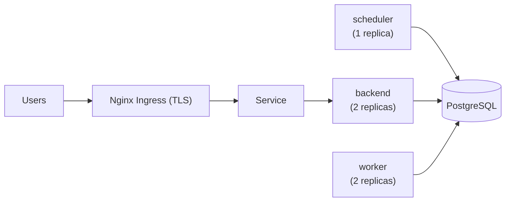

## Requirements

To successfully deploy InfraKitchen, ensure that your system meets the following minimum requirements:

- **Python**: Version 3.14
- **Node.js**: Version 24
- **PostgreSQL**: Version 17
- **Nginx**: Version 1.28
- **OpenTofu/Terraform**: Version 1.10
- **Yarn**: Version 1.22
- **Git Client**: Latest stable version

## Docker Image

InfraKitchen provides a multi-stage Dockerfile that builds the backend (Python + OpenTofu/Terraform + AWS CLI) and the frontend (Node.js), and serves the UI through the bundled Nginx.

The example file also references the Nginx configs and entrypoint script shipped in the same directory:

- [`docs/examples/docker/Dockerfile`](https://github.com/electrolux-oss/infrakitchen/blob/main/docs/examples/docker/Dockerfile)
- [`docs/examples/docker/nginx.conf`](https://github.com/electrolux-oss/infrakitchen/blob/main/docs/examples/docker/nginx.conf)
- [`docs/examples/docker/websocket-map.conf`](https://github.com/electrolux-oss/infrakitchen/blob/main/docs/examples/docker/websocket-map.conf)
- [`docs/examples/docker/entrypoint.sh`](https://github.com/electrolux-oss/infrakitchen/blob/main/docs/examples/docker/entrypoint.sh)

To build the docker image, run the following command from the root directory of the project:

```bash
docker build -f docs/examples/docker/Dockerfile -t your-image-name:tag .
```

## Kubernetes

InfraKitchen provides an example manifest: [`docs/examples/docker/k8s-manifest.yaml`](https://github.com/electrolux-oss/infrakitchen/blob/main/docs/examples/docker/k8s-manifest.yaml).

It contains an Nginx Ingress, a Service, and backend, scheduler, and worker
Deployments, wired to PostgreSQL:



Use it directly, or as a base for your own manifest.

:::note
PostgreSQL is assumed to be running and accessible from the Kubernetes cluster.
:::

<Steps>

<Step title="Prepare the manifest">

Replace the placeholders `<SERVICE_ACCOUNT_NAME>`, `<IMG_NAME>`, `<POSTGRES_HOST>` and `<HOST_NAME>` with your actual values.

</Step>

<Step title="Create the namespace and switch context">

Skip the first command if the namespace already exists.

```bash
kubectl create namespace infrakitchen
kubectl config set-context --current --namespace=infrakitchen
```

</Step>

<Step title="Generate secrets for JWT and encryption keys">

The following command generates the two secret values the platform needs — an
`ENCRYPTION_KEY` for encrypting stored secrets and a `JWT_KEY` for signing
authentication tokens:

```bash
python server/generate_encryption_key.py
```

Rerunning the script produces fresh values you can use to rotate the keys.
Note that rotating the `ENCRYPTION_KEY` invalidates everything encrypted with
the previous one (e.g. stored integration credentials), so plan the rotation
accordingly.

</Step>

<Step title="Create the secret">

Create the secret with the two values generated in the previous step and your
PostgreSQL password:

```bash
kubectl create secret generic infrakitchen-secrets \
                --from-literal="enc-secret=<ENCRYPTION_KEY generated in the previous step>" \
                --from-literal="jwt-secret=<JWT_KEY generated in the previous step>" \
                --from-literal="postgres-password=<password of the PostgreSQL infrakitchen user>"
```

</Step>

<Step title="Apply the manifest">

The manifest references the secret created in the previous step:

```bash
kubectl apply -f docs/examples/docker/k8s-manifest.yaml
```

</Step>

</Steps>
