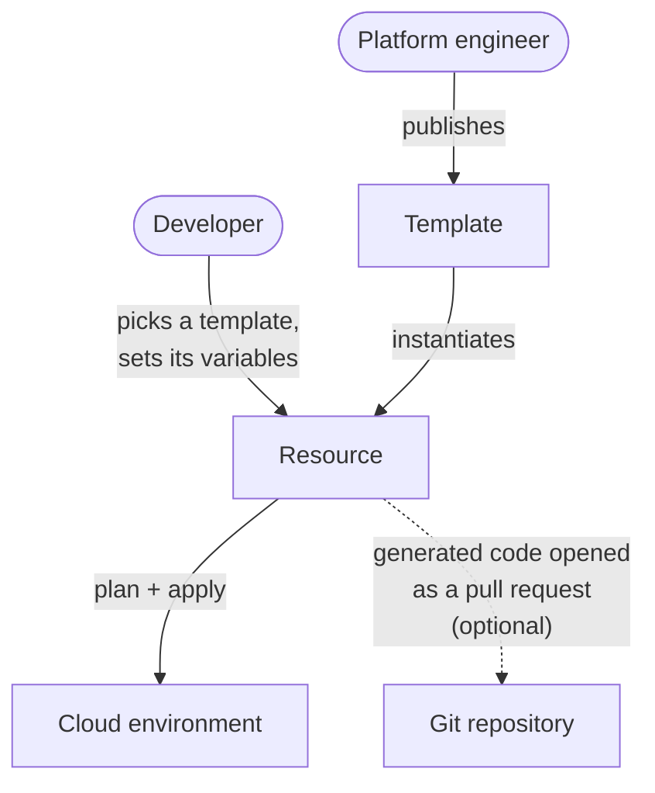

**InfraKitchen** is an open-source developer platform for Platform Engineering.

Platform engineers publish **golden paths** — reusable, versioned infrastructure as code. Developers provision them **self-service** through a guided interface, adopting new versions as they evolve, without needing deep knowledge of cloud platforms or IaC tools.

Under the hood, InfraKitchen generates OpenTofu/Terraform code for every Resource, runs it against your cloud environment, and can publish the generated code to your Git repositories as pull requests for review. Every change leaves an audit trail.

InfraKitchen is a good fit for organizations with OpenTofu/Terraform modules that want to offer developers self-service infrastructure. It supports anything OpenTofu/Terraform can provision, runs self-hosted, and is free under the Apache-2.0 license.

:::tip[Two words to know]
A **[Template](concepts/template)** is the reusable, versioned definition of a piece of infrastructure that a platform engineer publishes — a network, a Kubernetes cluster, a database. A **[Resource](concepts/resource)** is one deployed instance of a template. Everything else builds on these two concepts.
:::

## How It Works in Practice

Say a platform team wants to make Kubernetes clusters self-service:

<Steps>

<Step title="Platform engineer publishes the template">
The platform engineer registers the OpenTofu/Terraform modules repository and publishes a **Kubernetes Cluster** template with validated variables.
</Step>

<Step title="Developer creates the resource">
A developer picks the template, sets the guided inputs — cluster name, size, region — and creates the resource.
</Step>

<Step title="Reviewer approves the change">
The developer previews the plan while the change awaits approval. A reviewer with admin access then approves it.
</Step>

<Step title="Developer applies the change">
Once approved, the developer applies the change — InfraKitchen's worker runs the OpenTofu/Terraform commands, with progress and logs streaming live.
</Step>

</Steps>

Developers without direct cloud access can now create resources — no cloud credentials on their machine, no OpenTofu/Terraform CLI, every step audited.

## Why InfraKitchen?

| Alternative | How InfraKitchen differs |
| --- | --- |
| **Running OpenTofu/Terraform manually** | Guardrails are built in: variable validation, approval gates, role-based access, scheduling, and a full audit trail. Developers need no direct cloud access, no CLI, and no credentials on their machine. |
| **CI/CD pipelines** | Provisioning is interactive and state-aware, not a fire-and-forget job: live logs, per-resource status, resource dependencies, and destroy flows included. |
| **Developer portals** | Complements developer portals rather than replacing them: InfraKitchen focuses on the provisioning flow. |
| **Kubernetes-native control planes** | Kubernetes-native control planes manage infrastructure through continuous reconciliation; InfraKitchen is task-driven, with a UI and approval flows, and runs with or without a Kubernetes cluster. |

## How InfraKitchen Helps

### For Platform Teams

- **Build golden paths**: publish versioned templates, evolve them over time, and reuse them across environments and accounts through a template hierarchy.
- **Enforce standards** with versioned templates and variable validation rules.
- **Audit every change** for compliance, visibility, and traceability.

### For Developers

- **Provision approved infrastructure** by selecting a template and setting its variables in the guided UI.
- **Work independently** — governance stays with the platform team.
- **Stay informed** — every change is version-controlled and auditable.

## Getting Started

**Platform engineers** set up the foundation once:

1. Set up [Integrations](integrations/overview) (e.g., your cloud provider and your Git provider).
2. Register Code Repositories and define Templates in a parent/child hierarchy.
3. Add Template Versions and configure variable validation rules.

**Developers** then provision self-service, with no setup of their own:

1. Select a [Template](concepts/template) and Template Version.
2. Set the template's variables in the guided UI.
3. Provision — InfraKitchen runs the plan and apply, and reports progress.

Continue to the [Quick Start](quick-start) to run InfraKitchen locally, or read [Architecture](architecture) to understand how the system works under the hood.
