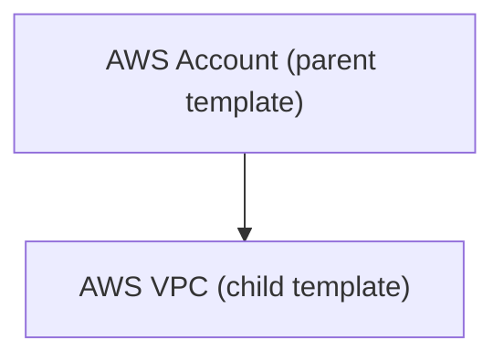

In about **10 minutes**, **Part 1** will have you run InfraKitchen locally and provision your first resource from a dummy template. **Part 2** then connects AWS and provisions a real VPC in about **18** more minutes.

{/* Fragment-link targets for #nix|#docker|#podman deep links. */}
<span id="nix"></span>
<span id="docker"></span>
<span id="podman"></span>
<span id="podman-compose"></span>

## Part 1 — Your First Resource, No Cloud

This part takes about <Badge color="blue" icon="clock" shape="pill">10 min</Badge>

### Prerequisites

- **Nix** (preferred) or **Podman/Docker** — pick one in the tabs below
- **git**, to clone the repository

:::tip[No other installs needed]
No separate OpenTofu/Terraform CLI, Python, or Node.js installation is needed — the Nix or Podman/Docker setup provides everything, including [PostgreSQL](https://www.postgresql.org/) for storing data and [RabbitMQ](https://www.rabbitmq.com/) for processing events. No cloud account is needed either — Part 1 runs entirely on your machine.
:::

### 1. Run InfraKitchen Locally

Clone the repository:

```bash
git clone https://github.com/electrolux-oss/infrakitchen.git
cd infrakitchen
```

Pick the option that matches your machine:

<Tabs>

<Tab title="Nix">

```bash
# If no Nix is installed, run the official installer first:
# curl -L https://nixos.org/nix/install | sh -s -- --daemon

nix --extra-experimental-features 'nix-command flakes' develop
```

:::tip[Enable the experimental features permanently]
The flag above applies to this run only. To enable both features permanently, add the following to `/etc/nix/nix.conf` (or `~/.config/nix/nix.conf` on macOS) and restart the Nix daemon:

```
experimental-features = nix-command flakes
```
:::

</Tab>

<Tab title="Docker">

```bash
cp docs/examples/docker/docker-compose.yml ./docker-compose.yml
docker compose up -d
```

</Tab>

<Tab title="Podman">

```bash
cp docs/examples/docker/docker-compose.yml ./docker-compose.yml
podman compose up -d
```

:::tip[Containers can't reach each other?]
If containers cannot reach each other, stop and restart them:

```bash
podman compose down && podman compose up -d
```
:::

</Tab>

<Tab title="Podman Compose">

```bash
cp docs/examples/docker/docker-compose.yml ./docker-compose.yml
podman-compose up -d
```

:::tip[Containers can't reach each other?]
If containers cannot reach each other, stop and restart them:

```bash
podman-compose down && podman-compose up -d
```
:::

</Tab>

</Tabs>

Open [http://localhost:7777](http://localhost:7777), click **Log in as a Guest**, and choose **Guest Login (Super User)** — this role has the admin permissions the walkthrough needs.

### 2. Add a Public Git Repository Integration

InfraKitchen imports templates from Git repositories. Both the dummy template and InfraKitchen itself are public, so no Git account or token is needed:

<Steps>

<Step title="Create the integration">

On the welcome page, click **Connect Git** and choose **Public Git Repository**. Give it a **Name** (e.g. `PublicGit`) — no credentials or URL are needed, it just tells InfraKitchen it may clone public repositories.

</Step>

</Steps>

:::tip
For private Git repositories, use a GitHub, GitLab, Bitbucket, or Azure DevOps integration instead — see [Git Providers](integrations/git).
:::

### 3. Import the Dummy Template

The [example templates repository](https://github.com/electrolux-oss/infrakitchen-example-templates) contains a [dummy template](https://github.com/electrolux-oss/infrakitchen-example-templates/tree/main/demo/00-dummy) that provisions only random, local resources — no cloud provider, no credentials, no cost:

<Steps>

<Step title="Import the template">

Go to **Templates** and click <kbd>Import</kbd>:

| Field | Value |
| :--- | :--- |
| **Git Integration** | `PublicGit` |
| **Repository URL** | `https://github.com/electrolux-oss/infrakitchen-example-templates` |
| **Directory Path** | `demo/00-dummy` |
| **Branch** | `main` (default) |

Name it **Dummy** and click <kbd>Import</kbd> — InfraKitchen scans the module to extract its variables and outputs.

</Step>

</Steps>

### 4. Add Local State Storage

Every resource stores its OpenTofu/Terraform state in a [storage](concepts/overview#storage). Without a cloud, use the PostgreSQL instance InfraKitchen already runs locally:

<Steps>

<Step title="Create the PostgreSQL integration">

In InfraKitchen, go to **Configurations > Integrations**, click **Connect Cloud**, and choose **PostgreSQL**. Fill in the fields with the default values for the local PostgreSQL instance:

| Field | Value |
| :--- | :--- |
| **Integration Name** | Any name, e.g. `LocalPostgres` |
| **Host** | `localhost` if you run via Nix, `postgres` if you run via Docker/Podman |
| **Port** | `5432` |
| **User** | `dev_user` |
| **Password** | `password` |
| **Database** | Any name, e.g. `infrakitchen_states` — created automatically if it does not already exist |
| **SSL Mode** | `disable` — the local instance does not use TLS |

Click <kbd>Test Connection</kbd> and save.

</Step>

<Step title="Create the storage">

Go to **Configurations > Storage** and click <kbd>Create</kbd>. Choose the **PostgreSQL** provider and fill in the fields:

| Field | Value |
| :--- | :--- |
| **Name** | Any name, e.g. `LocalStorage` |
| **Integration** | The `LocalPostgres` integration you created above |
| **Schema Name** | Any name, e.g. `demo_states` |

Click <kbd>Save</kbd>, then click <kbd>Apply</kbd> to provision it, and wait until the status shows `PROVISIONED [DONE]`. You can open the **Log Stream** (terminal icon) to follow progress in real time.

</Step>

</Steps>

### 5. Provision the Dummy Resource

<Steps>

<Step title="Create the resource">

Go to **Templates**, find the **Dummy** template, and click <kbd>Create Resource</kbd>. Give it a name (e.g. `Dummy Resource`), select the **Template Version** (`main`), and select the **storage** from [step 4](#4-add-local-state-storage) — no integration is needed. The variables all have defaults, so leave them as they are.

</Step>

<Step title="Dry run, then provision">

Save, click <kbd>Plan</kbd> to preview the changes, then click <kbd>Review</kbd> and <kbd>Approve</kbd> — new resources require approval before they can be applied. Click <kbd>Apply</kbd> to provision it. When the status turns `PROVISIONED`, check the resource's **Outputs** (e.g. `deployment_id` and `instance_names`) — you have provisioned your first resource, entirely locally.

</Step>

<Step title="Destroy the resource">

When you are done, go to the resource's **Settings** tab, and in the **Danger Zone**, click <kbd>Destroy</kbd>, type the resource's name to confirm, and click <kbd>Destroy</kbd> again. Click <kbd>Review</kbd> and <kbd>Approve</kbd>, then click <kbd>Plan</kbd> and <kbd>Apply</kbd> again to actually destroy it.

</Step>

</Steps>

## Part 2 — Connect AWS and Provision a VPC

This part takes about <Badge color="blue" icon="clock" shape="pill">18 min</Badge>

### Prerequisites

- An **AWS account** where you can create an IAM user
- InfraKitchen still running [locally](#1-run-infrakitchen-locally), with the [`PublicGit`](#2-add-a-public-git-repository-integration) integration already set up

### 1. Connect AWS

InfraKitchen provisions through an IAM user in your AWS account.

<Steps>

<Step title="Create an IAM user and access keys">

In the AWS console, create a dedicated IAM user with **programmatic access** and generate an **Access Key ID** and **Secret Access Key**. For this walkthrough, attach `AdministratorAccess` — it keeps the proof of concept simple. Scope the permissions down for real use; see [Cloud Providers](integrations/cloud).

</Step>

<Step title="Add the integration in InfraKitchen">

In InfraKitchen, go to **Configurations > Integrations**, click **Connect Cloud**, and choose **AWS**:

| Field | Value |
| :--- | :--- |
| **Integration Name** | e.g. `AWSDemo` |
| **AWS Account ID** | Your AWS account ID |
| **Access Key ID** | The generated Access Key ID |
| **Secret Access Key** | The generated Secret Access Key |
| **Automatically create S3 bucket for OpenTofu/Terraform remote state** | Checked — this creates the bucket that stores your infrastructure state |

</Step>

<Step title="Test the connection">

Click <kbd>Test Connection</kbd> and save once it passes.

</Step>

</Steps>

### 2. Import the AWS Templates

The same [example templates repository](https://github.com/electrolux-oss/infrakitchen-example-templates) also contains ready-to-use AWS modules. Import two of them:

<Steps>

<Step title="Import the account template">

Go to **Templates** and click <kbd>Import</kbd>:

| Field | Value |
| :--- | :--- |
| **Git Integration** | `PublicGit` |
| **Repository URL** | `https://github.com/electrolux-oss/infrakitchen-example-templates` |
| **Directory Path** | `demo/01-aws-account` |
| **Branch** | `main` (default) |

Name it **AWS Account** and click <kbd>Import</kbd> — InfraKitchen scans the module to extract its variables and outputs.

</Step>

<Step title="Import the VPC template">

Repeat with **Directory Path** `demo/02-aws-vpc`, name it **AWS VPC**, and pick **AWS Account** under **Select Parents**.

</Step>

</Steps>

The resulting template hierarchy is:



### 3. Provision the Account Resource

Provision the account resource before creating the VPC resource.

:::tip
The IAM role it creates is not used in this example — the account resource demonstrates the parent → child workflow.
:::

<Steps>

<Step title="Create the AWS Account resource">

Go to **Templates**, find the **AWS Account** template, and click <kbd>Create Resource</kbd>. Fill in the fields and variables:

| Field | Value |
| :--- | :--- |
| **Name** | e.g. `demo-account` |
| **AWS integration** | Select `AWSDemo` |
| **Storage** | Select `infrakitchen_AWSDemo` |
| **Template Version** | Select `main` |
| Variable: `account` | Your AWS account ID |
| Variable: `master_account_id` | Your AWS account ID |
| Variable: `region` | e.g. `eu-central-1` |

</Step>

<Step title="Dry run, then provision">

Save, click <kbd>Plan</kbd> to preview the changes, then click <kbd>Review</kbd> and <kbd>Approve</kbd>. Click <kbd>Apply</kbd> to provision it. Wait until the status turns `PROVISIONED`.

</Step>

</Steps>

### 4. Provision the VPC

<Steps>

<Step title="Create the VPC resource">

Create another resource from the **AWS VPC** template and fill in the fields and variables:

| Field | Value |
| :--- | :--- |
| **Name** | e.g. `demo-vpc` |
| **Parent** | Select `demo-account` |
| **AWS integration** | Select `AWSDemo` |
| **Storage** | Select `infrakitchen_AWSDemo` |
| **Template Version** | Select `main` |
| Variable: `account` | Your AWS account ID |
| Variable: `name` | e.g. `demo-vpc` |
| Variable: `cidr_block` | `10.20.0.0/16` |

</Step>

<Step title="Dry run, then provision">

Save, click <kbd>Plan</kbd> to preview the changes, then click <kbd>Review</kbd> and <kbd>Approve</kbd>. Click <kbd>Apply</kbd> to provision it. When the status turns `PROVISIONED`, check the resource's **Outputs** — your VPC is live in AWS, created entirely through InfraKitchen!

</Step>

</Steps>

### 5. Clean Up

Go to the **demo-account** resource's **Settings** tab, and in the **Danger Zone**, click <kbd>Cascade Destroy</kbd>, type the resource's name to confirm, and click <kbd>Cascade Destroy</kbd> again — InfraKitchen creates a destroy workflow covering the account resource and the VPC beneath it, and opens it. Click <kbd>Apply</kbd> to run the workflow: both resources are destroyed in the right order (children first).

Exit the Nix shell with <kbd>Ctrl</kbd>+<kbd>D</kbd>, or stop InfraKitchen with `docker compose down`.

:::tip[Just want a quick look?]
Run `make fixtures` to populate the instance with realistic mock data. It runs on the host, so use the Nix dev shell (or an environment with `uv` and PostgreSQL reachable on `localhost`). Everything above also works on an empty instance.
:::

## Default Settings

For local development, InfraKitchen automatically configures the following on first run — no manual setup needed:

- **Encryption & signing keys** — `ENCRYPTION_KEY` encrypts sensitive data at rest (e.g. stored integration credentials), and `JWT_KEY` signs auth tokens. Generated into `server/.env_local`.
- **Data storage** (Nix only) — PostgreSQL data, RabbitMQ data/logs, and other local state are stored in the `ik_data/` directory. Delete this directory to start the project from scratch. (Docker/Podman store data in their own named volumes instead.)
